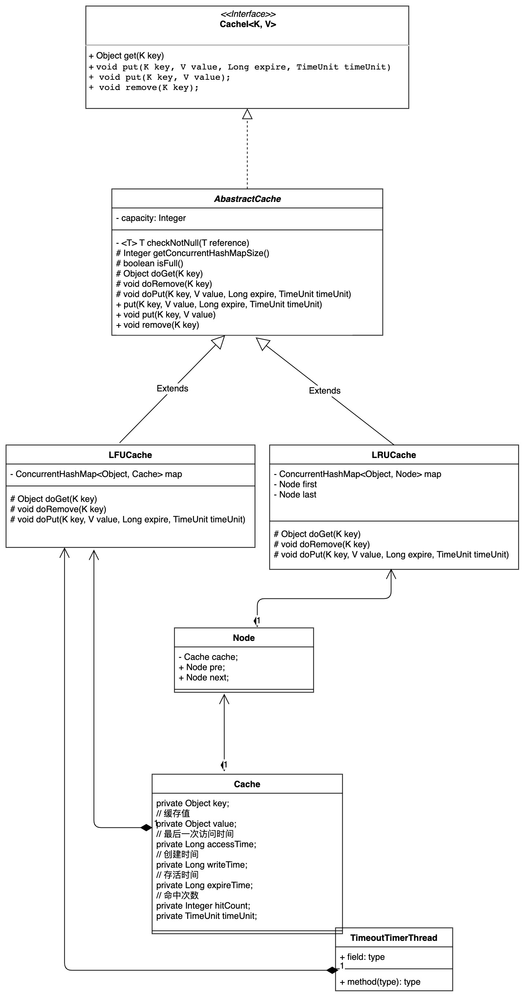
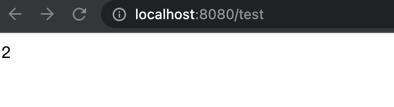

# 研发背景
项目的创作主要来源于工作中，经常使用到各种缓存，但是redis缓存成本太高，谷歌的本地缓存功能过于丰富，实际开发用不到那么多功能  
所以自行研发一套轻量级别的本地缓存框架
# 框架结构图
本次框架提供LFU和LRU算法两套本地缓存算法，默认使用LRU算法，学习redis核心思想，在容量满时，采用惰性删除和定时删除方案。  
代码结构图如下：

# 使用方式
yml配置type可选LFU和LRU,如果不配置，默认使用LRU  
capacity为容量，如果不设置，默认为2的10次方
```yaml
local:
  cache:
    type: LRU
    capacity: 16
```
具体使用可以查看example文件目录
首先注入LocalCacheTemplate
```java
@Autowired
private LocalCacheTemplate<Object, Object> localCacheTemplate;
```
核心方法
```java
    // 获取缓存
    Object get(K key);
    // 缓存存储, 设置过期时间
    void put(K key, V value, Long expire, TimeUnit timeUnit);
    // 缓存存储
    void put(K key, V value);
    // 缓存删除
    void remove(K key);
```
# 测试案例
```java
@RestController
public class CacheTest {
    @Autowired
    private LocalCacheTemplate<Object, Object> localCacheTemplate;
    @RequestMapping("test")
    public String text() {
        localCacheTemplate.put("1", "2");
        return localCacheTemplate.get("1").toString();
    }
}
```
结果  



